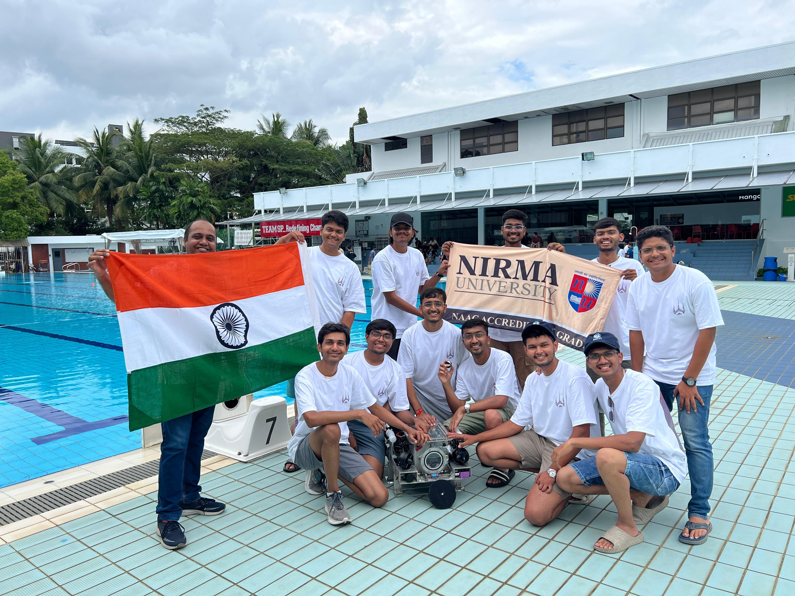
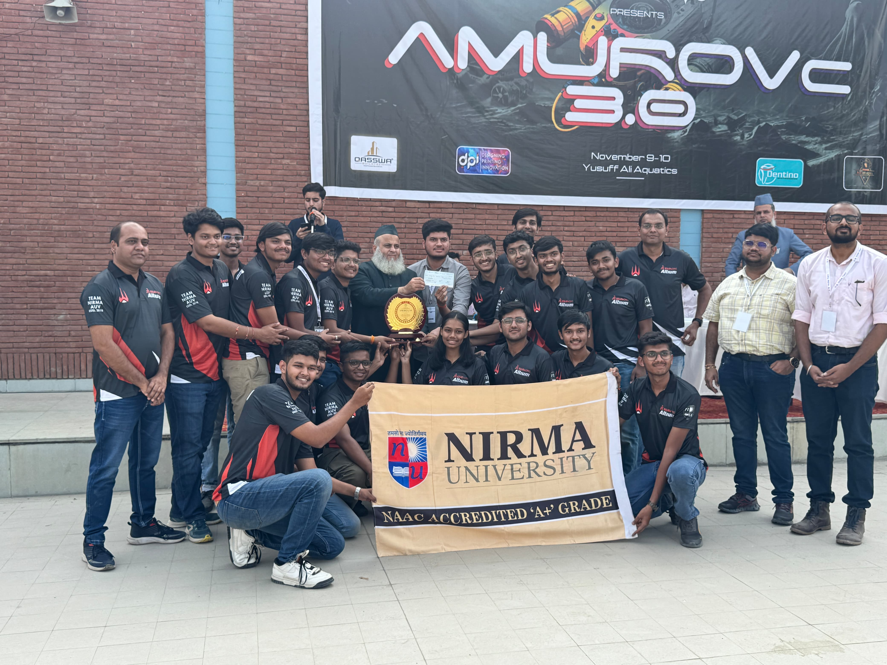

# team-nirma-auv-portfolio Moksh Kandhari

Welcome to my robotics and embedded systems portfolio!  
I’m a core team member of **Team Nirma AUV**, where I specialize in autonomy, sensor integration, and real-time control systems using ROS and embedded microcontrollers.

> 🥈 2nd Worldwide – SAUVC 2025  
> 🏅 Finalist – SAUVC 2024  
> 🥇 2× National Winner – AMUROVc  
> 🥇 1st Nationally – ROBOFEST 4.0  
> 🥈 2nd Nationally – ROBOFEST 3.0  

---

## 🔍 Project Highlights

### 1. [Barcode Vision Mapping System](projects/barcode-vision-system/overview.md)
> Real-time barcode localization for underwater autonomous navigation using OpenCV and ROS.

### 2. [Joystick Teleoperation System](projects/joystick-teleop-control/overview.md)
> Manual override system using ROS Joy and custom teleop nodes for mission safety.

### 3. [IMU + Depth GUI](projects/imu-depth-gui/overview.md)
> A PyQt GUI showing live IMU and pressure sensor data along with camera feed using ROS and OpenCV.

---

## 📸 Highlights

---

## 🧠 Tools & Tech
- **Languages**: Python, C++, C (Teensy), Bash
- **Frameworks**: ROS1 (Melodic), OpenCV, PyQt, micro-ROS (learning)
- **Hardware**: Teensy 4.1, BNO08x, Jetson Nano, Pressure Sensors

---

## 🏆 Achievements
- 🥈 2nd Worldwide – SAUVC 2025 (Singapore)
- Finalists – SAUVC 2024 (Singapore)
- 🥇 1st Place – AMU National ROV Comp (2023 & 2024)
- 🧪 Developed custom autonomy stack for AUV with sensor fusion and mission execution
- Honored by President of University of Cincinnati
---

📫 Feel free to reach out or explore more!

